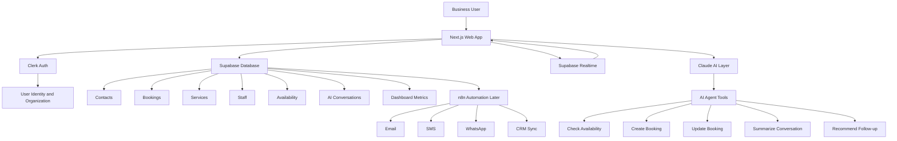
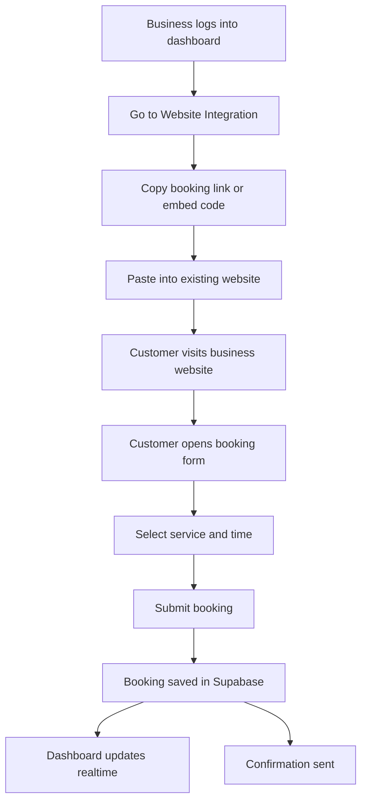
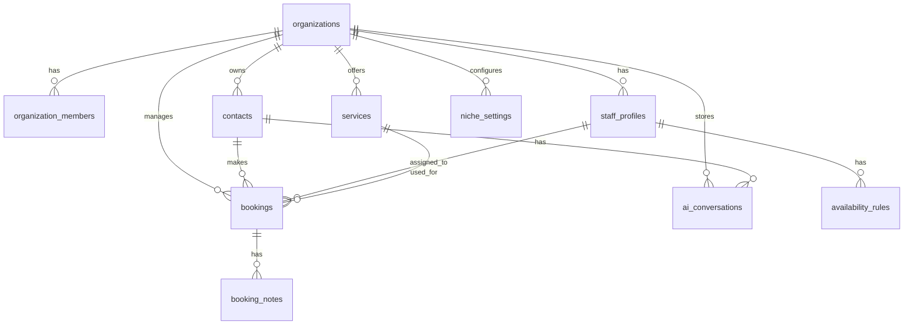
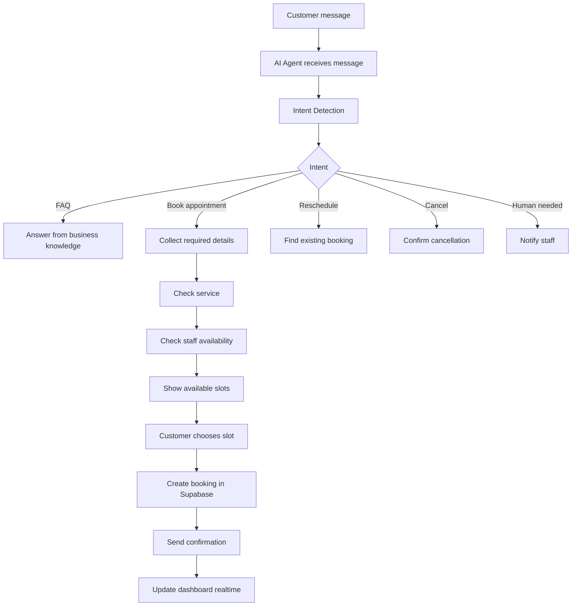
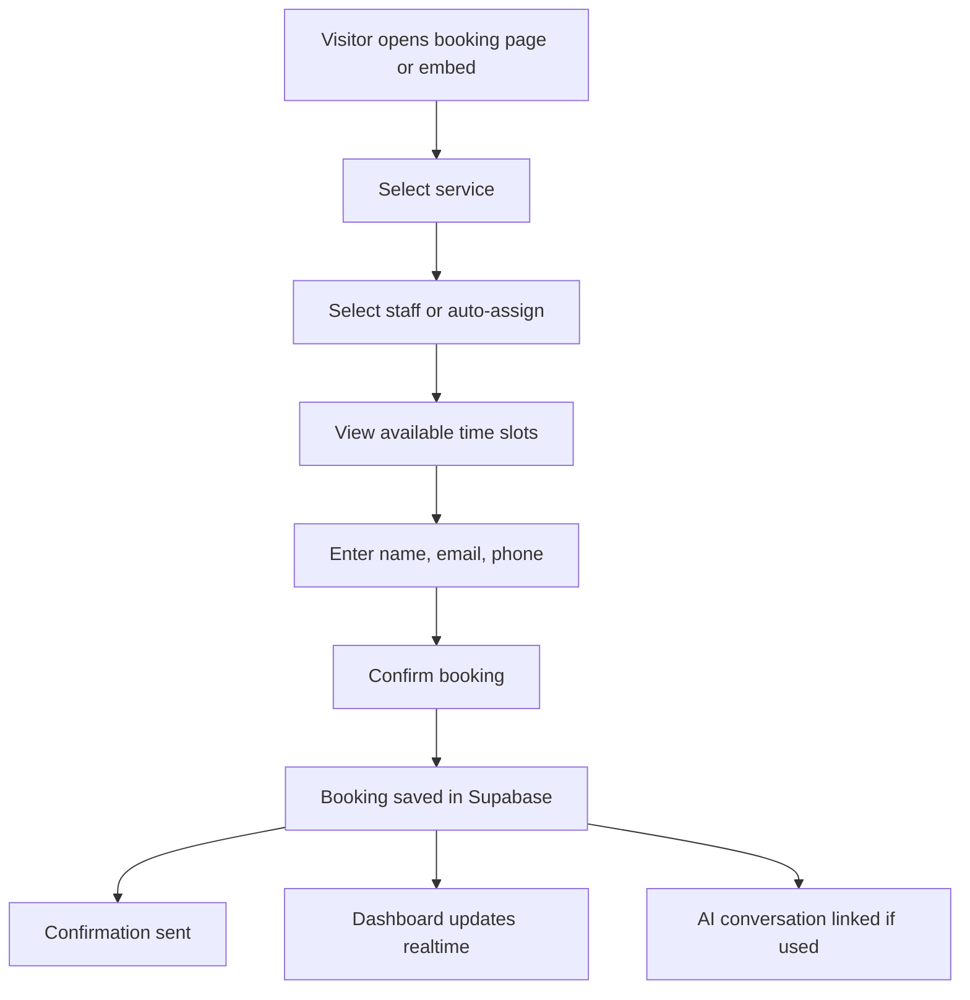
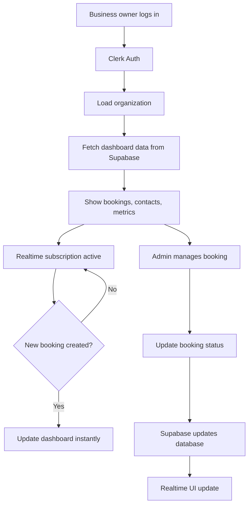
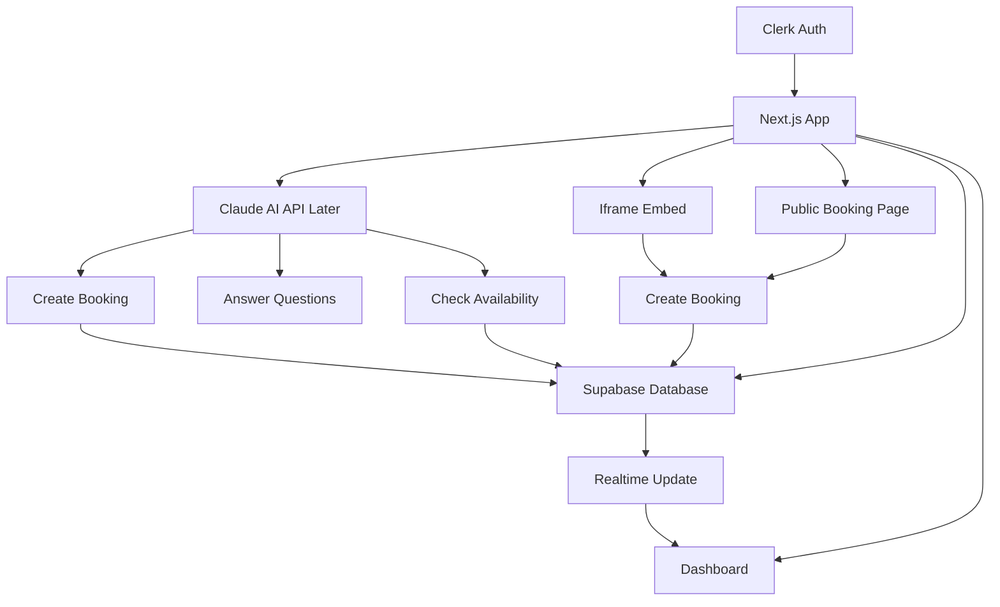

# AI Appointment Booking & Client Management SaaS Architecture

## 1. Project Diagnosis

This starter kit should not be treated as only a clinic management system. The stronger product is a reusable appointment booking and client management SaaS that can adapt to different niches.

The clinic version uses words like **patients**, **doctors**, and **appointments**, but the real system should use generic backend concepts like **contacts**, **staff**, **services**, and **bookings**.

That way, the same SaaS can work for clinics, real estate agencies, salons, tutors, legal firms, agencies, fitness coaches, and other service businesses.

---

## 2. Product Direction

### Core Product

A SaaS platform where a business can:

- Sign up and create an organization.
- Choose their niche or business type.
- Set up services.
- Add staff/team members.
- Set availability.
- Accept bookings through a public page or website embed.
- Manage contacts, clients, leads, or patients.
- Use AI to answer questions, handle booking queries, and summarize conversations.
- View bookings and dashboard updates in real time.

### Best Positioning

Do not position this only as:

> Clinic Management Software

Position it as:

> AI-powered booking and client management system for service businesses.

This creates more selling angles and allows the same backend to serve many industries.

---

## 3. Niche Adaptation Logic

The main system should use generic database and code names. The frontend can display niche-specific labels.

| Generic System Term | Clinic | Real Estate | Agency | Tuition | Beauty Salon | Legal |
|---|---|---|---|---|---|---|
| Contact | Patient | Lead / Client | Client | Student / Parent | Customer | Client |
| Staff | Doctor | Agent | Consultant | Teacher | Stylist | Solicitor |
| Booking | Appointment | Viewing / Call | Discovery Call | Lesson | Booking | Consultation |
| Service | Treatment | Valuation / Viewing | Service | Course / Lesson | Treatment | Legal Service |
| Notes | Patient Notes | Deal Notes | Client Notes | Progress Notes | Service Notes | Case Notes |

### Important Rule

Do not hardcode:

- patient
- doctor
- clinic
- treatment
- medical

Use generic names in the backend:

- contacts
- staff_profiles
- organizations
- services
- bookings
- notes
- niche_settings

---

## 4. Recommended Tech Stack

### Frontend

- Next.js
- TypeScript
- Tailwind CSS
- shadcn/ui
- Lucide icons
- React Hook Form
- Zod validation
- Recharts for graphs

### Authentication

- Clerk

Clerk should manage:

- Sign up
- Login
- Sessions
- User profiles
- Organizations
- Roles
- Team invitations

### Backend and Database

- Supabase Postgres
- Supabase Realtime
- Supabase Storage
- Supabase Row Level Security
- Supabase Edge Functions if needed later

Supabase should store:

- Organizations
- Contacts
- Bookings
- Services
- Staff
- Availability
- AI conversations
- Dashboard data

### AI Layer

- Claude AI for intelligent responses
- Optional later: OpenAI, Gemini, DeepSeek, or OpenRouter model routing

The AI should not blindly control the app. It should use structured tools/actions.

### Automation Layer

- n8n later

Use n8n for:

- Email reminders
- SMS reminders
- WhatsApp reminders
- Follow-up sequences
- Lead enrichment
- CRM sync
- Missed booking recovery
- Internal notifications

### Payments Later

- Stripe

Use Stripe later for:

- SaaS subscriptions
- Paid bookings
- Deposits
- Cancellation fees

---

## 5. High-Level Architecture



---

## 6. Two-Sided SaaS Structure

The system should have two main sides.

### 1. Admin Dashboard

Used by the business owner and team.

It includes:

- Dashboard
- Bookings
- Contacts
- Services
- Staff
- Availability
- AI conversations
- Analytics
- Website integration settings
- Organization settings

### 2. Website Integration Layer

Used by customers through the business website.

It includes:

- Public booking page
- Iframe booking embed
- AI chat widget later
- Public booking API

This is what makes the system easy to integrate with any existing website.

---

## 7. Website Integration Strategy

### Phase 1: Hosted Booking Page

Each business gets a public booking URL:

```text
https://yourapp.com/book/smile-dental
https://yourapp.com/book/horsham-estate-agents
https://yourapp.com/book/webvoxel-studio
```

The business can add this as a button on their website:

```text
Book Appointment
```

This is the easiest MVP and works with any website.

### Phase 2: Iframe Booking Embed

Each business gets an embed page:

```text
https://yourapp.com/embed/booking/smile-dental
```

The business can copy this into their website:

```html
<iframe
  src="https://yourapp.com/embed/booking/smile-dental"
  width="100%"
  height="750"
  style="border:0; border-radius:12px;"
></iframe>
```

This works with:

- WordPress
- Wix
- Webflow
- Shopify
- Framer
- Squarespace
- Custom websites

### Phase 3: JavaScript Booking Widget

Later, create a script-based widget:

```html
<script
  src="https://yourapp.com/widgets/booking.js"
  data-org="smile-dental">
</script>
```

### Phase 4: AI Chat Widget

Later, create a chatbot widget:

```html
<script
  src="https://yourapp.com/widgets/chat.js"
  data-org="smile-dental">
</script>
```

The chatbot can:

- Answer FAQs
- Collect contact details
- Check availability
- Book appointments
- Escalate to human staff
- Save conversations into the dashboard

---

## 8. Website Integration Flowchart



---

## 9. App Route Structure

```text
app/
  layout.tsx
  page.tsx

  sign-in/
  sign-up/

  onboarding/
    page.tsx

  dashboard/
    layout.tsx
    page.tsx

    bookings/
      page.tsx
      [id]/
        page.tsx

    contacts/
      page.tsx
      [id]/
        page.tsx

    services/
      page.tsx

    staff/
      page.tsx

    availability/
      page.tsx

    ai-agent/
      page.tsx

    settings/
      page.tsx
      integrations/
        page.tsx

  book/
    [organizationSlug]/
      page.tsx

  embed/
    booking/
      [organizationSlug]/
        page.tsx
    chat/
      [organizationSlug]/
        page.tsx

  api/
    public/
      organizations/
      services/
      availability/
      bookings/
      chat/

    webhooks/
      clerk/
        route.ts
      stripe/
        route.ts
```

---

## 10. Recommended Folder Structure

```text
src/
  app/
  components/
    dashboard/
    bookings/
    contacts/
    services/
    staff/
    availability/
    ai/
    integrations/
    shared/

  lib/
    supabase/
    clerk/
    ai/
    utils/

  server/
    actions/
      bookings.ts
      contacts.ts
      services.ts
      availability.ts
      staff.ts
      organizations.ts

  types/
    booking.ts
    contact.ts
    organization.ts
    service.ts
    staff.ts
    ai.ts

  config/
    niche-templates.ts
```

---

## 11. Core Database Tables

Recommended core tables:

```text
users
organizations
organization_members
niche_settings
contacts
services
staff_profiles
availability_rules
bookings
booking_notes
ai_conversations
ai_messages
notifications
audit_logs
```

Every tenant-scoped table should include:

```text
organization_id
```

This makes the SaaS multi-tenant.

---

## 12. Database Relationship Diagram



---

## 13. Suggested Table Fields

### organizations

```text
id
name
slug
industry
logo_url
created_at
updated_at
```

### organization_members

```text
id
organization_id
user_id
role
created_at
updated_at
```

Roles:

- owner
- admin
- staff
- viewer

### niche_settings

```text
id
organization_id
niche_type
contact_label
staff_label
booking_label
service_label
dashboard_config
custom_fields
created_at
updated_at
```

Example:

```json
{
  "niche_type": "clinic",
  "contact_label": "Patient",
  "staff_label": "Doctor",
  "booking_label": "Appointment",
  "service_label": "Treatment"
}
```

### contacts

```text
id
organization_id
full_name
email
phone
status
source
tags
notes
custom_fields
created_at
updated_at
deleted_at
```

Use `custom_fields` for niche-specific information.

Clinic example:

```json
{
  "date_of_birth": "2002-05-14",
  "medical_notes": "Allergic to penicillin"
}
```

Real estate example:

```json
{
  "budget": "£350,000",
  "property_type": "2-bed flat",
  "location": "Croydon"
}
```

Agency example:

```json
{
  "business_name": "ABC Ltd",
  "monthly_leads": 40,
  "problem": "slow follow-up"
}
```

### services

```text
id
organization_id
name
description
duration_minutes
price
is_active
created_at
updated_at
```

### staff_profiles

```text
id
organization_id
user_id
full_name
email
phone
role_title
is_active
created_at
updated_at
```

### availability_rules

```text
id
organization_id
staff_id
day_of_week
start_time
end_time
timezone
buffer_minutes
max_bookings
created_at
updated_at
```

### bookings

```text
id
organization_id
contact_id
service_id
staff_id
start_time
end_time
status
source
meeting_link
notes
created_at
updated_at
```

Booking statuses:

- pending
- confirmed
- cancelled
- completed
- no_show
- rescheduled

### ai_conversations

```text
id
organization_id
contact_id
channel
status
summary
last_message_at
created_at
updated_at
```

### ai_messages

```text
id
conversation_id
role
content
tool_used
metadata
created_at
```

---

## 14. Public API Design

Public APIs are used by public booking pages, iframe embeds, and future widgets.

Public users should only be able to:

- View public organization info
- View active services
- View available slots
- Create bookings
- Send chatbot messages

Public users should not be able to:

- View all contacts
- View private staff information
- View dashboard analytics
- Edit settings
- Delete data

### Get Public Organization Info

```text
GET /api/public/organizations/:slug
```

Example response:

```json
{
  "name": "Smile Dental",
  "industry": "clinic",
  "logoUrl": "...",
  "contactLabel": "Patient",
  "bookingLabel": "Appointment"
}
```

### Get Services

```text
GET /api/public/services?org=smile-dental
```

Example response:

```json
[
  {
    "id": "service_123",
    "name": "Dental Check-up",
    "durationMinutes": 30,
    "price": 45
  }
]
```

### Get Availability

```text
GET /api/public/availability?org=smile-dental&serviceId=service_123
```

Example response:

```json
[
  {
    "startTime": "2026-05-05T10:00:00Z",
    "endTime": "2026-05-05T10:30:00Z"
  }
]
```

### Create Booking

```text
POST /api/public/bookings
```

Example body:

```json
{
  "organizationSlug": "smile-dental",
  "serviceId": "service_123",
  "staffId": "staff_456",
  "startTime": "2026-05-05T10:00:00Z",
  "customer": {
    "fullName": "John Smith",
    "email": "john@email.com",
    "phone": "07123456789"
  }
}
```

---

## 15. AI Agent Architecture

The AI should use structured tools.

### AI Tools

```text
get_business_info
get_services
check_availability
create_booking
reschedule_booking
cancel_booking
get_contact
create_contact
update_contact
summarize_conversation
notify_staff
```

### AI Agent Flow



---

## 16. Public Booking Flow



---

## 17. Admin Dashboard Flow



---

## 18. Integration Settings Page

Inside the dashboard, create:

```text
Settings > Website Integration
```

Show three options.

### Option 1: Booking Link

```text
https://yourapp.com/book/smile-dental
```

Button:

```text
Copy Link
```

### Option 2: Embed Code

```html
<iframe
  src="https://yourapp.com/embed/booking/smile-dental"
  width="100%"
  height="750"
  style="border:0; border-radius:12px;"
></iframe>
```

Button:

```text
Copy Embed Code
```

### Option 3: Chat Widget Later

```html
<script
  src="https://yourapp.com/widgets/chat.js"
  data-org="smile-dental">
</script>
```

Button:

```text
Copy Chat Code
```

---

## 19. Realtime Dashboard Requirements

Use Supabase Realtime for:

- New booking created
- Booking status changed
- New contact created
- New AI message received
- Staff availability changed
- Notification created

Example behavior:

```text
Customer books appointment -> Supabase insert -> dashboard updates instantly
```

No refresh needed.

---

## 20. MVP Feature Scope

Build this first.

### Phase 1 MVP

- Clerk auth
- Organization onboarding
- Niche selection
- Dashboard layout
- Contacts module
- Services module
- Staff module
- Availability module
- Public booking page
- Iframe embed page
- Booking management
- Supabase realtime dashboard updates
- Website integration settings page
- Basic Claude AI assistant later in MVP

### Do Not Build First

Avoid these at the start:

- Complex calendar sync
- Full payment system
- Voice AI
- WhatsApp automation
- Advanced CRM pipeline
- White-label custom domains
- Too many niche-specific features

Build the core booking system first.

---

## 21. Phase 1 MVP Architecture



---

## 22. Phase 2 Features

After MVP works, add:

- Stripe billing
- Team invitations
- Email reminders
- SMS reminders
- Google Calendar sync
- Outlook Calendar sync
- AI conversation history
- Booking analytics
- Custom forms
- Customer portal
- File uploads

---

## 23. Phase 3 SaaS Features

Later, add:

- White-label dashboards
- Custom domain per business
- Advanced AI workflows
- n8n automation marketplace
- Industry-specific templates
- CRM pipeline
- Lead scoring
- Voice AI receptionist
- WhatsApp booking agent
- Multi-location support

---

## 24. Execution Plan: Next 72 Hours

### Day 1: Audit and Refactor Plan

Tasks:

- Review starter kit files.
- Search for hardcoded clinic terms.
- List all places using patient, doctor, clinic, treatment, or medical.
- Decide generic naming.
- Create a refactor map.

Replace:

| Starter Kit Term | New Generic Term |
|---|---|
| patients | contacts |
| doctors | staff_profiles |
| clinic | organization |
| appointments | bookings |
| treatments | services |
| patient notes | contact notes |

Deliverable:

```text
Refactor map document
```

### Day 2: Database and Auth Foundation

Tasks:

- Set up Clerk auth.
- Connect Supabase.
- Create organizations table.
- Create organization_members table.
- Create niche_settings table.
- Create contacts table.
- Create services table.
- Create staff_profiles table.
- Create availability_rules table.
- Create bookings table.
- Set up basic RLS policies.

Deliverable:

```text
Multi-tenant database foundation
```

### Day 3: Booking and Dashboard MVP

Tasks:

- Build dashboard layout.
- Build contacts list.
- Build services page.
- Build staff page.
- Build availability page.
- Build public booking page.
- Build iframe embed page.
- Create booking API.
- Connect Supabase realtime to dashboard.
- Add website integration settings page.

Deliverable:

```text
Working booking MVP with website integration
```

---

## 25. Strategic Upside and Downside

### Best Case

This becomes a reusable SaaS engine that can be sold into multiple service niches.

Potential offers:

- AI booking system for clinics
- AI viewing system for estate agents
- AI discovery call system for agencies
- AI booking CRM for salons
- AI tutor scheduling system
- AI consultation booking system for legal firms

### Worst Case

If the system is built too clinic-specific, it becomes hard to reuse. You would need to rewrite the backend when targeting another niche.

### Main Risk

The main risk is building AI features before the booking and database logic is solid.

### Correct Strategy

Build the reliable booking and CRM engine first. Then attach AI on top.

---

## 26. Chess Move

Competitors usually sell either:

- A booking page like Calendly
- A chatbot
- A basic CRM
- A niche-specific management system

Your counter-position:

> Keep your existing website. Add an AI-powered booking, client management, and follow-up system that plugs into your business in minutes.

This is stronger because businesses do not need to replace their website.

---

## 27. Final Recommendation

Build this as:

```text
Next.js dashboard + Clerk auth + Supabase backend + public booking API + iframe embed layer + Claude AI agent layer
```

MVP priority:

```text
1. Admin dashboard
2. Public booking page
3. Iframe embed
4. Integration settings page
5. Supabase realtime
6. AI assistant after booking logic is stable
```

The product should not be locked to clinics. It should be a reusable appointment booking and client management SaaS that can adapt to any service business.

The strongest pitch:

> You do not need to replace your website. Add our AI booking and client management system to your existing site.

